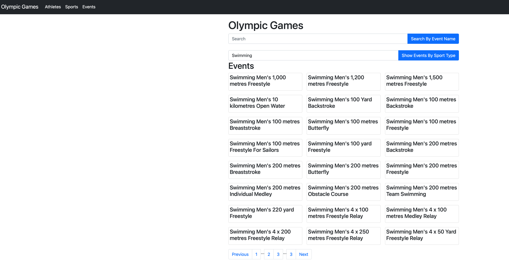

# cs5200project1

## Contributors

- Orkhan Dadashov
- Meilin Liu


<hr/>

## Part1 - Design & Implement a Relational Database

<hr/>
 
### Source file link  for our project from kaggle

[Olympic Games data file](https://www.kaggle.com/heesoo37/120-years-of-olympic-history-athletes-and-results/version/2)

### Project documentation (PDF file ) includes: 
- The requirements document as a PDF.
- UML Class Diagram as an embedded JPG/PNG.
- ERD as an embedded JPG/PNG and URL to its LucidChart diagram.
- Definition of relational schema with proof that it is in BCNF.

### SQL files will nclude:
- Creat Table : Table creation queries
- Create Table and insert queries

### SQLite DB file:
Which will include already populated tables

### Python notebbok included :
Description : I have created this file to automate reading the excel file and creating the tables an populating it
- Python notebook
- html of the python notebook

### UML
[Project1 UML](https://lucid.app/lucidchart/47f13deb-0c7c-49cc-9430-6288f6ab24e9/edit?invitationId=inv_6602d40b-2285-42b7-b5b8-753d12cb2c87&page=sAIlboIWdedJ#)


### ERD 
[Project1 ERD](https://lucid.app/lucidchart/47f13deb-0c7c-49cc-9430-6288f6ab24e9/edit?viewport_loc=-596%2C4%2C3669%2C1955%2CRkZlGXn.R~cp&invitationId=inv_6602d40b-2285-42b7-b5b8-753d12cb2c87)


### DB Tables


### DB Testing incorrect medal Type
- INSERT INTO Participations(eventID, gameID, medal, athleteID) VALUES(765, 30, "Copper", 1) 


### DB Unique Constraint Check
- INSERT INTO Participations(eventID, gameID, medal, athleteID) VALUES(765, 30, "Gold", 106890) 


### DB FK/ PK Constraint Check
- INSERT INTO Participations(eventID, gameID, medal, athleteID) VALUES(766, 30, "Gold", 106890)


<hr/>

## Part2 - Node + Express application

<hr/>

### How to run the code ?

1) Clone the repo
2) Install the dependencies

```
npm install
```


3) Start the server

```
npm start
```

4) Point your browser to http://localhost:3000


### Application Functionalities

All pages support pagination.

#### Main Page - Olymic Games

Main Page showing all the olympic games by city where it was held.


Supports searching games by city


#### Athletes page

Athletes Main Page, which includes Search bar for searching athlete by name, create an athlete, edit athlete information and delete athlete. 


Search by Athlete Name function


Edit Athlete Page


Now We will demostrate edit function
We pick an Athlete


We Update Athlete`s Name


An Edit result


Athlete edit page includes the game athlete participated


On Athlete page creating new Athlete


New Athlete creation status


After new Athlete created


Athlete to be deleted


Deletion Status


Deletion result


#### Sports page
Sports Main Page Which includes search by sports type  and also supports get gender statistics per Sport Type


Searching Sport By Name


Searching Sport By Name Result


#### Events page

Events Page, which inludes 2 search bars.Search by event Name and Show events by sport Type


Search by Event Name result


Search by Sports Type result
