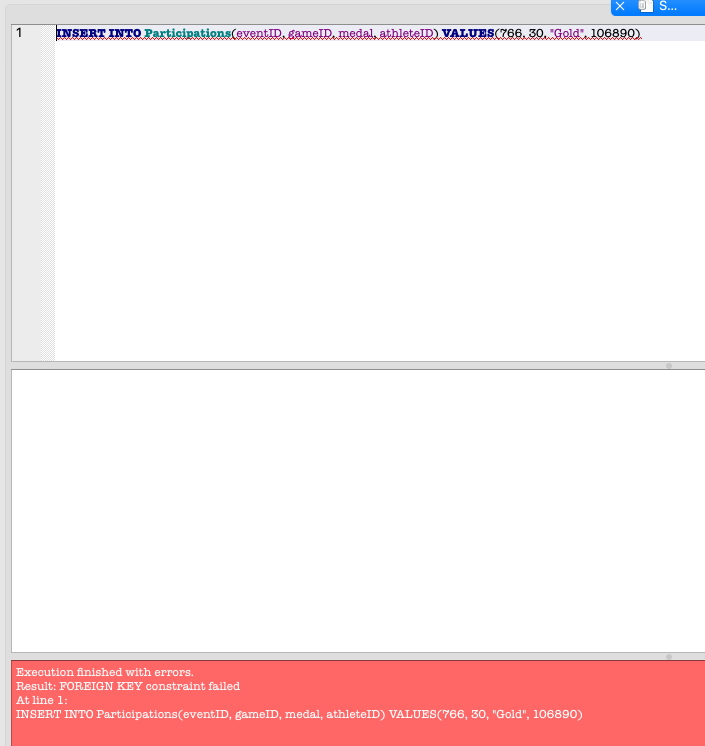

# cs5200project1

## Source file link  for our project from kaggle

[Olympic Games data file](https://www.kaggle.com/heesoo37/120-years-of-olympic-history-athletes-and-results/version/2)

## Project documentation (PDF file ) includes: 
- The requirements document as a PDF.
- UML Class Diagram as an embedded JPG/PNG.
- ERD as an embedded JPG/PNG and URL to its LucidChart diagram.
- Definition of relational schema with proof that it is in BCNF.

## SQL files will nclude:
- Creat Table : Table creation queries
- Create Table and insert queries

## SQLite DB file:
Which will include already populated tables

## Python notebbok included :
Description : I have created this file to automate reading the excel file and creating the tables an populating it
- Python notebook
- html of the python notebook

## UML
[Project1 UML](https://lucid.app/lucidchart/47f13deb-0c7c-49cc-9430-6288f6ab24e9/edit?invitationId=inv_6602d40b-2285-42b7-b5b8-753d12cb2c87&page=sAIlboIWdedJ#)

## ERD 
[Project1 ERD](https://lucid.app/lucidchart/47f13deb-0c7c-49cc-9430-6288f6ab24e9/edit?viewport_loc=-596%2C4%2C3669%2C1955%2CRkZlGXn.R~cp&invitationId=inv_6602d40b-2285-42b7-b5b8-753d12cb2c87)

## DB TAbes

## DB Testing incorrect medal Type
- INSERT INTO Participations(eventID, gameID, medal, athleteID) VALUES(765, 30, "Copper", 1) 

## DB Unique Constraint Check
- INSERT INTO Participations(eventID, gameID, medal, athleteID) VALUES(765, 30, "Gold", 106890) 

## DB FK/ PK Constraint Check
- INSERT INTO Participations(eventID, gameID, medal, athleteID) VALUES(766, 30, "Gold", 106890)
